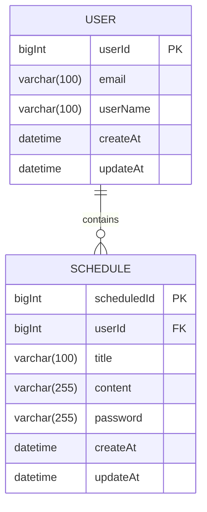

# Calendar
# SchedulerProject
## API 명세서

| 기능         | Method | URL                    | Request   | Response           | 상태코드        |
|--------------|--------|-------------------------|-----------|-------------------|-----------------|
| 스케줄 등록   | POST   | /api/schedules          | 요청 body   | 등록된 일정 정보    | 201 Created     |
| 전체 조회     | GET    | /api/schedules          | 없음        | 일정 목록 배열     | 200 OK          |
| 단건 조회     | GET    | /api/schedules/{id}     | 요청 path   | 단일 일정 정보     | 200 OK          |
| 스케줄 수정   | PUT    | /api/schedules/{id}     | 요청 path   | 수정된 일정 정보    | 200 OK          |
| 스케줄 삭제   | DELETE | /api/schedules/{id}     | 요청 path   | 없음              | 204 No Content  |

> 비밀번호가 일치하지 않으면:  
> Response: { "message": "비밀번호가 일치하지 않습니다." }  
> 상태코드: 403 Forbidden 또는 400 Bad Request

## ERD
